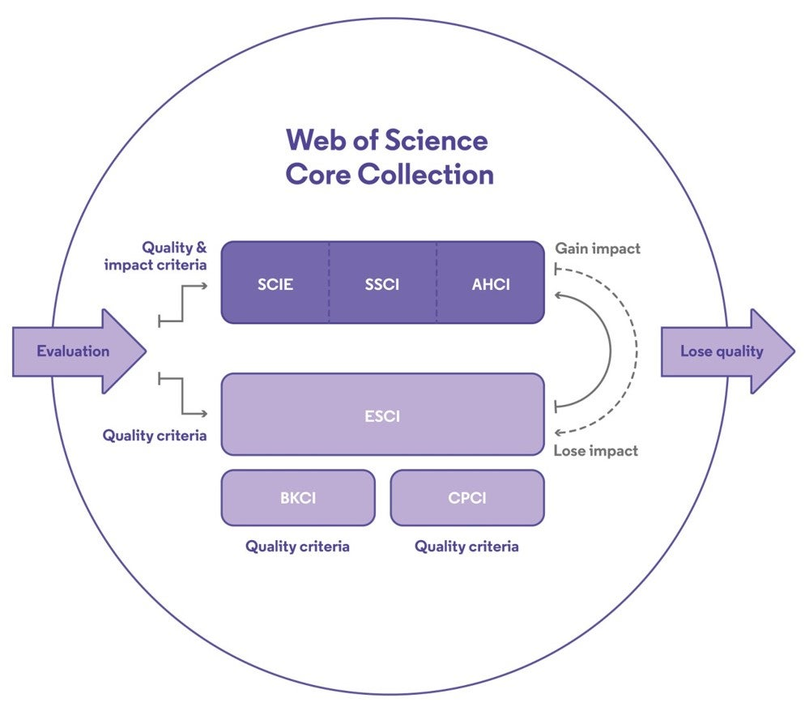

[toc]

> 本着坚持实事求是、确保陈述内容有理有据、拒绝道听途说的原则，本文优先参考官方文献、其次参考百度百科、再次参考其余二手或多手网络资源。阅读本文过程中如有任何疑问，欢迎随时提出质疑并反馈给**把本文发给你的人**。
>

# Web of Science

Web of Science (wos) 平台是 Clarivate 公司旗下的产品之一，通过这个平台可以检索很多文献资源，比如 Web of Science Core Collection (woscc)、Chinese Science Citation Database (CSCD)、KCI - Korean Journal Database 等[^1]。其中 woscc 是 wos 平台的主要资源，它包括 4 个期刊引文数据库（SCIE、SSCI、AHCI、ESCI）、1个图书引文数据库（BKCI）和1个会议论文集引文数据库（CPCI）[^2]。

## Web of Science Core Collection

> 检索链接：https://webofscience.clarivate.cn/wos/woscc/basic-search

### SCIE、SSCI、AHCI与ESCI

Science Citation Index Expanded (SCIE) 是**科学**期刊的引文数据库，Social Sciences Citation Index (SSCI) 是**社会科学**期刊的引文数据库，Arts & Humanities Citation Index (AHCI) 是**艺术和人文**期刊的引文数据库，Emerging Sources Citation Index (ESCI) 是不被 SCIE、SSCI 和 AHCI 收录的高质量期刊的引文数据库[^3]。

对于提交评估申请的期刊，Clarivate公司会对其进行quality评估和impact评估，满足quality指标的期刊会被ESCI收录；ESCI中满足impact指标的期刊会被移至SCIE、SSCI或AHCI；SCIE、SSCI或AHCI不满足impact指标的期刊会被移至ESCI；ESCI中不再满足quality指标的期刊会被移除[^4]。

> 相比SCI，SCIE包括了更多高质量的区域性期刊。2020年1月，考虑到SCI和SCIE在选刊标准上已经没有区别，为了减少重复和不必要的误解，Clarivate公司决定不再使用SCI的叫法，统一称为SCIE收录文章[^5]。所以按理说SCI其实已经是过时的说法了，不过现在很多人依然会习惯性地采用SCI的说法。

###  BKCI

Book Citation Index (BKCI) 是科学和社会科学领域专著和丛书的引文数据库[^3]。对于提交评估申请的图书，通过quality指标即可被BKCI收录。BKCI又细分为[^6]

- Book Citation Index– Science (BKCI-S)
- Book Citation Index– Social Sciences & Humanities (BKCI-SSH)

### CPCI

Conference Proceedings Citation Index (CPCI) 是各学科领域最重要的会议的已发表文献的引文数据库[^3]。对于提交评估申请的会议论文集，通过quality指标即可被CPCI收录。CPCI又细分为[^6][^7]

- Conference Proceedings Citation Index- Science (CPCI-S)
- Conference Proceedings Citation Index- Social Science & Humanities (CPCI-SSH)

> CPCI-S和CPCI-SSH的前身分别是ISTP（科学技术会议录索引）和ISSHP（社会科学及人文科学会议录索引）两大会议录索引[^8]。因此出于习惯，目前仍有ISTP的说法。

Web of Science Core Collection 的评估过程如图1所示。

图1 woscc评估过程

## 其他文献数据库

### CSCD

Chinese Science Citation Database (CSCD) 是中国科学引文数据库，它创建于1989年，收录我国数学、物理、化学、天文学、地学、生物学、农林科学、医药卫生、工程技术和环境科学等领域出版的中英文科技核心期刊和优秀期刊千余种，被誉为“中国的SCI”[^9]。

CSCD 来源期刊每两年遴选一次，遴选对象为我国出版的中、英文学术性期刊。期刊需经过国家新闻出版广电总局批准出版，同时具有 ISSN、CN 两个标准刊号。经过定量遴选、专家定性评估， 2023-2024年度中国科学引文数据库收录来源期刊1340种，其中中国出版的英文期刊317种，中文期刊1023种。 CSCD来源期刊分为核心库和扩展库两部分，其中核心库996种、扩展库344种。[^10]。

CSCD 与 Clarivate 公司合作，将 CSCD 搭载在 Web of Science 平台上，实现与 SCI 数据库的整合检索[^11]，为从世界看中国，从中国看世界的提供信息发现服务。

### KCI - Korean Journal Database

基于Web of Science的KCI韩国期刊数据库，使世界各地的研究人员能够从韩国的研究成果中发掘新的视角，从而获得相关领域更为完整的研究发展全貌[^12]。

# Elsevier

Elsevier 公司旗下有很多产品，Engineer Village 和 ScienceDirect 就是其中之二[^13]。

## Engineer Village

> 检索链接：https://www.engineeringvillage.com/search/quick.url

通过Engineer Village 平台可以检索很多文献数据库资源，比如 Compendex、Inspec 等[^14]。

### Compendex

Compendex 是 Elsevier 的旗舰工程数据库，其中包含期刊、会议论文集等文献资源[^15]。我没有在官网找到 Compendex 的历史，但它就是大家常说的 Ei (Engineering Index) [^16][^17]。 Compendex 的评价指标是 Scopus，考虑的因素包括 Self-citation rate、Total citation rate 和 CiteScore[^18]。

### Inspec

Inspec 包含物理、电气工程和电子、计算机和控制、机械和生产工程、信息技术等领域的记录。内容也包括期刊、会议论文集等文献资源[^19]。

## ScienceDirect

> 检索链接：https://www.sciencedirect.com

ScienceDirect 数据库涵盖 Physical Sciences and Engineering、Life Sciences、Health Sciences、Social Sciences and Humanities 领域[^20]。在 Engineer Village 中查看全文会链接到出版商的网站，而 ScienceDirect 中的文献是 Elsevier 公司自己出版的，所以查看全文进入的仍是 Elsevier 自己的网页。

# 文献数据库及其来源期刊

前面提到的 SCIE、CSCD、Compendex 都属于**文献数据库**，它们会记录每篇 paper 的文章标题、所属期刊、出版商、引文索引等信息。这些数据库中的 paper 总是来源于某些期刊，我们将这些期刊统称为数据库**来源期刊**。本章将介绍一些前面没有提到过的数据库及其来源期刊。

## CSSCI

中文社会科学引文索引（Chinese Social Sciences Citation Index，简称CSSCI）是由南京大学中国社会科学研究评价中心开发研制的引文数据库，用来检索**中文人文社会科学领域**的论文收录和被引用情况[^21][^22]。

CSSCI来源期刊俗称“**南大核心**”或“**C刊**”。南大核心的学术范畴是人文社科领域，被国内学术界广泛认可[^21][^23]。

## CSTPCD

中国科技论文与引文数据库 (CSTPCD) 选择的期刊称为“中国科技核心期刊”，又称“中国科技论文统计源期刊”。“中国科技核心期刊”的选取经过了严格的同行评议和定量评价，是中国各学科领域中较重要的、能反映本学科发展水平的科技期刊。“中国科技核心期刊”每年进行遴选和调整。中国科技核心期刊目录分自然科学卷和社会科学卷[^24]。

# 学术评价

我们常说某某期刊被 **SCIE** 、**CSCD核心库**或者 **EI Compendex** 收录，这其实就是一种学术评价。因为能被这些知名数据库收录，说明这个期刊已经满足了相应的质量标准。同理，还有一些说法也是这个道理：

- 某某期刊的影响因子是……
- 某某期刊是**北大核心**/**南大核心**/**JCR Q1**/**中科院一区**/**CCF A**/**顶刊**

## 学术期刊评价指标

### 影响因子(IF)

IF 是加菲尔德在 1972 年提出的一个评价期刊的重要指标。该指标是一个相对数量指标，主要用以调整和修正期刊总被引频次过大。普赖斯曾提出，科学论文一般在其发表后一二年后，被人们接受，并达到被引用的峰值阶段。加菲尔德正式按照这个思想，定义了 IF 的计算公式，
$$
\mathrm{IF}=\frac{\text{某刊前2年发表论文{\color{red}在该年的被引用次数}}}{该刊前2年发表论文{\color{red}总数}}
$$
后文介绍的**JCR分区**主要参考这一指标。

### 3年平均IF

即期刊3年影响因子的平均值，
$$
\text{3年平均IF}=\frac{\text{当年IF $+$ 去年IF $+$ 前年IF}}{3}
$$
后文介绍的**中科院JCR分区基础版**主要参考这一指标。

### 最近两年的期刊被引频次(CI)

如题，CI 就是 CI 。

后文介绍的**中科院JCR分区基础版**中的Top期刊遴选会参考这一指标。

### 期刊超越指数

期刊超越指数旨在克服唯IF论的弊端，计算方式相对复杂。关于期刊超越指数计算公式的官方链接似乎已经失效，若想了解可以参考这篇文章[^25]。

后文介绍的**中科院JCR分区升级版**主要参考这一指标。

## JCR分区

Journal Citation Reports (JCR) 也是 Clarivate 公司旗下的产品之一，他提供了 Journal Impact Factor (JIF)、Journal Citation Indicator (JCI)、5年 IF 等多项评价指标。

JCR 使用 JIF 指标将期刊分为四个区 Q1、Q2、Q3、Q4。把某一个学科的所有期刊都按照 JIF 降序排列，然后将 Q1、Q2、Q3、Q4 的百分位底线分别是 25%、50%、75%、100% 。

> JCR 分区细节我没有仔细验证，可能存在偏差，但感觉问题不大。

以前只有 SCIE 与 SSCI 才会有 JIF 指标，自报告 2022 年的指标开始，AHCI 与 ESCI 也会参与计算 JIF [^26]。

## 中科院JCR分区

> 中科院JCR分区，有些文章会说中科院SCI分区，或简称中科院分区，这些都是一个意思。
>
> 如果直接说“一区”、“二区”，有的人会默认JCR分区，有的人会默认中科院分区。所以我们自己说的时候应该尽可能避免歧义。

### 基础版

中科院分区表**对 JCR 中的 SCI 期刊**在学科内依据 3 年平均 IF 划分分区。它包括大类分区和小类分区：大类分区是将期刊按照自定义的 13 个学科所做的分区，大类分区包括 Top 期刊；而小类分区是将期刊按照 JCR 已有学科分类体系所做的分区。

中科院分区表选择学术影响力作为划分方式，把每个学科的所有期刊按照学术影响力（3 年平均 IF）由高到底降序排列，依次划分为 4 个区。 3 年平均 IF 最高的 5%的期刊为 1 区期刊。2—4 区期刊使用 3 年平均 IF 总和相同的方式划分。具体划分方式为：

- 把每一个学科的期刊集合（数量为 n 本）按照 3 年平均 IF 降序排列，以下各步计算，均基于此顺序。
- 前 5%期刊（该学科期刊总数量的 5%，即 5%*n）为 1 区期刊
- 剩下的 95%期刊中，计算它们的 3 年平均 IF 的总和（S），然后求总和的1/3（S/3），剩下 3 个区的每区的期刊影响力累积和各为 S/3
- 上一步的期刊集合（也即除 1 区期刊外的期刊集合）中，从第 1 本期刊往后计数，如果它们的 3 年平均 IF 的总和（S2）等于上个步骤计算出的总和 S/3，那么这些期刊就是 2 区期刊；相同的方式可以划分出 3 区期刊，剩下所有期刊为4 区期刊（S2=S3=S4= S/3）。

> 网上很多文章说4个分区的底线分别是5%，20%，50%，100%，来源似乎是LetPub[^27]，可能是几年前的分区方式，不过确实可以粗略地这么认为。

为了在分区方法的基础上遴选出更多优秀的期刊，他们在分区表的大类分区中设置**Top期刊**。Top期刊遴选方法如下：将1区期刊划入Top范围内；2区中2年总被引频次指标位于前10%的期刊也归入Top期刊集合。2015年，Top期刊的界定原则有所变化，在上述定量测度规则的基础上新增同行评议的考量因素。对于少数期刊，尽管不在上述定量方法划分出来的Top期刊的范围中，但经过科学共同体评议，被认为是高学术影响力期刊，直接被采纳加入Top期刊。

更多介绍请参见分区表官网[^28]，本文这一部分主要参考其中的《中科院JCR期刊分区说明文档》。

### 升级版

从2022年开始，分区表只发布升级版结果，分区指标不再采用“3年平均IF”，而是替换为**“期刊超越指数”**。另外，分区表升级版包括**SCIE、SSCI和ESCI数据库**，共设置了包括自然科学和社会科学在内的18个大类。此外，分区表升级版会先计算每篇论文在相应学科的影响力，最后汇总整本期刊的影响力水平[^29][^30]。

## 北大核心

北大核心是指由北京大学图书馆及北京十几所高校图书馆众多期刊工作者及相关单位专家参加的中文核心期刊评价研究项目成果**《中文核心期刊要目总览》**，已经出版了1992、1996、2000、2004、2008、2011、2014、2017、2020年版共9版，主要是为图书情报部门对中文学术期刊的评估与订购、为读者导读提供参考依据。

《中文核心期刊要目总览》在2008年之前每4年更新研究和编制出版一次，2008年之后，改为每3年更新研究和编制出版一次，每版都会根据当时的实际情况在研制方法上不断调整和完善，以求研究成果能更科学合理地反映客观实际。研究方法是定量和定性相结合的分学科评价方法，核心期刊定量评价采用被摘量(全文、摘要)、被摘率(全文、摘要)、被引量、他引量(期刊、博士论文)、影响因子、 他引影响因子、5年影响因子、5年他引影响因子、特征因子、论文影响分值、论文被引指数、互引指数、获奖或被重要检索工具收录、基金论文比(国家级、省部级)、Web下载量、Web下载率等评价指标；在定量评价的基础上，再进行专家定性评审。经过定量筛选和专家定性评审，**从我国正式出版的中文期刊中评选出核心期刊**[^31]。

## 社科院核心

社科院核心，即中国社会科学院的“中国人文社会科学核心期刊”[^32]。

## CCF推荐

中国计算机学会（China Computer Federation，简称CCF）是中国计算机及相关领域的学术团体，宗旨是为本领域专业人士的学术和职业发展提供服务；推动学术进步和技术成果的应用；**进行学术评价，引领学术方向**；促进技术和产业应用一线的交流和互动；对在学术和技术方面有突出成就的个人、企业和单位给予认可和表彰。CCF 的品牌活动包括我们熟知的 CSP 认证[^33]。

CCF 的学术评价包括**《中国计算机学会推荐国际学术会议和期刊目录》**（以下简称《CCF国际目录》）和《计算领域高质量科技期刊分级目录》（以下检查《CCF中文目录》）。

《CCF国际目录》[^34]第六版于2023年发布。目录分为A、B、C三类。《CCF国际目录》可以在 <https://ccf.atom.im/> 这个网站查看和筛选，CCF 推荐会议的截稿日期可以在 https://ccfddl.top/ 这个网站查看。

《CCF中文目录》[^35]于2022年发布，未来两到三年更新一次。目录分为T1、T2、T3三类，T1为最顶级期刊，T2为非常优秀期刊，T3为优秀期刊。其中，T1类期刊16本，T2类期刊23本，T3类期刊29本。《CCF中文目录》看似是2022年发布的新目录，实则是对2019年《中国计算机学会推荐中文科技期刊目录》[^36]的翻新。

> 在一般情况下，CCF A 指 《CCF国际目录》中的 A 类期刊或会议。

## 顶刊顶会

大牛们公认的顶刊顶会，主观因素较强，往往独立于其他学术评价指标。如计算机视觉领域的顶刊顶会包括CVPR、ICCV、ECCV、NeurIPS、ICML、ICLR。

# 文献检索平台

除了前面提到的 Web Of Science、Engineer Village和ScienceDirect，还有一些知名的文献检索平台。

## LetPub

LetPub中国站可以查询[^37]学术期刊的各项指标，包括JCR分区（即WOS期刊的SCI分区）、中科院分区和平均审稿速度。

## arXiv

arXiv 是一个免费的文档系统，涵盖物理学、数学、计算机科学等多个领域的文献，任何人都可以在 arXiv 上发表文章。arXiv 上的文章没有同行评审[^38]。

arXiv 每天都会出炉新鲜文章，有助于我们及时跟进最新研究。

# 小结

## 本文概要

- 本文介绍了一些知名的文献数据库：SCIE、CSCD、Compendex等

- 本文介绍了一些的评价方式：

  - 利用影响因子等定量指标直接评价

  - 利用知名数据库的来源期刊侧面评价

  - 一些公认的评价角度：北大核心、中科院分区、CCF推荐
  - 一些约定俗成的主观评价：顶刊顶会

- 本文介绍了一些文献/期刊检索平台

  - Web Of Science、Engineer Village、ScienceDirect、LetPub、arXiv

  - 一些本文没有提到的（知网、万方、Google Scholar、百度学术）也是大同小异

## 最后

根据“取乎其上，得乎其中；取乎其中，得乎其下；取乎其下，则无所得矣”的原则，我们应该看尽可能优秀的论文，但是优秀的论文也有很多，到底怎样才算真的优秀呢？这时我们可以参考一下自己学院或者专业的学术成果认定标准。

武汉理工大学计算机科学与技术专业的学术成果评级为：学术论文分七档，**中科院TOP**、**CCF A 的期刊和会议**、SCIENCE、NATURE、CELL为第一档；**JCR Q1**、**CCF B 的期刊**为第二档；**北大核心前10%**、**JCR Q2** 、**CCF C 的期刊**、**CCF B 的会议**为第三档；第四档略；**北大核心前20%** 、**JCR Q3 和 Q4** 为第五档、**CCF C 的会议** 为第六档；**北大核心**、**EI 期刊和会议**为第七档。

感觉计算机专业应该重点关注的还是 CCF 推荐和北大核心前列的会议和期刊。寻找领域内经典论文时可以考虑在 webofscience 和 elsevier 的平台搜索；跟进最新工作、或者避免自己的 idea 与别人重复时，可以优先在 arxiv 上浏览。

# 参考

[^1]: Web of Science platform. https://clarivate.com/products/scientific-and-academic-research/research-discovery-and-workflow-solutions/webofscience-platform/.
[^2]: Web of Science Core Collection. https://clarivate.com/products/scientific-and-academic-research/research-discovery-and-workflow-solutions/webofscience-platform/web-of-science-core-collection/.
[^3]: Getting started with Web of Science Core Collection. https://clarivate.com/webofsciencegroup/support/wos/wos-core-collection/.
[^4]: Web of Science期刊评估过程和遴选标准. https://clarivate.com/products/scientific-and-academic-research/research-discovery-and-workflow-solutions/webofscience-platform/web-of-science-core-collection/editorial-selection-process/editorial-selection-process/.
[^5]: Web of Science Core Collection：有关 SCI和SCIE区别说明. <https://support.clarivate.com/ScientificandAcademicResearch/s/article/Web-of-Science-Core-Collection核心合集有关-SCI和SCIE区别说明?language=zh_CN>.
[^6]: Web of Science Core Collection: Quick Reference Guide. https://support.clarivate.com/ScientificandAcademicResearch/s/article/Web-of-Science-Core-Collection-Quick-Reference-Guide.
[^7]: Conference Proceedings Citation index. http://wokinfo.com/products_tools/multidisciplinary/webofscience/cpci/.
[^8]: ISTP与CPCI的关系. http://www.ei-istp.com/New_169.html.
[^9]: 中国科学引文数据库官方介绍. http://sciencechina.cn/index_more1.jsp.
[^10]: 中国科学引文数据库来源期刊. http://sciencechina.cn/cscd_source.jsp.
[^11]: Web of Science平台所有数据库检索. https://webofscience.clarivate.cn/wos/alldb/basic-search.
[^12]: KCI - Korean Journal Database. https://clarivate.com/products/scientific-and-academic-research/research-discovery-and-workflow-solutions/kci-korean-journal-database/.
[^13]: Elsevier 公司产品. https://www.elsevier.com/products.
[^14]: engineering-village 主页. https://www.elsevier.com/products/engineering-village.
[^15]: Conpendex-官方介绍. https://www.elsevier.com/products/engineering-village/databases/compendex.
[^16]: Ei Compendex-维基百科. https://en.wikipedia.org/wiki/Ei_Compendex.
[^17]: Ei Engineering Index Database. https://tcutsg.tcu.edu.cn/info/1011/1016.htm.
[^18]: Scopus 内容选择. https://www.elsevier.com/products/scopus/content/content-policy-and-selection.
[^19]: Inspec-官方介绍. https://www.elsevier.com/products/engineering-village/databases/inspec.
[^20]: ScienceDirect 官网. https://www.sciencedirect.com/.
[^21]: CSSCI中文社会科学引文索引来源期刊（南大核心）. https://lib.cpu.edu.cn/e0/d3/c9615a123091/page.htm.
[^22]: 中文社会科学引文索引(CSSCI)简介. https://cssrac.nju.edu.cn/cpzx/zwshkxywsy/sjkjj/20191231/i63997.html.
[^23]: CSSCI，我们这样看！. https://cssrac.nju.edu.cn/xsdt/gbylw/20200102/i64473.html.
[^24]: 中国科技核心期刊. http://isee.istic.ac.cn/html/hexinqikan/hexinqikan.html.
[^25]: “期刊超越指数”为何取代“三年平均影响因子”. https://www.editage.cn/insights/qi-kan-chao-yue-zhi-shu-wei-he-qu-dai-san-nian-ping-jun-ying-xiang-yin-zi-219481. 2022.
[^26]: JCR 帮助. https://jcr.help.clarivate.com/Content/jcr3-journal-profile.htm.
[^27]: 最新JCR期刊IF及分区情况（中科院SCI期刊分区表）. https://www.letpub.com.cn/index.php?page=2012-sci-13-top
[^28]: 分区表官网. https://www.fenqubiao.com/
[^29]: 惊！分区表竟已推广期刊超越指数4年了. https://mp.weixin.qq.com/s?__biz=MzI1MzA2MzM1NA==&mid=2659568986&idx=1&sn=b82941ac94f8b8037173aa84078a03f2&chksm=f2ab548fc5dcdd9959a9873d2741e4a00242626d4fd2e94bdfd36cd14310879c1dbf3b666def&scene=178&cur_album_id=1390859076929961984#rd. 2022.
[^30]: 《2022年中国科学院文献情报中心期刊分区表》正式发布. https://zhuanlan.zhihu.com/p/593103999. 2022.
[^31]: 中文核心期刊要目总览-研究概况. http://hxqk.lib.pku.edu.cn/.
[^32]: 中国人文核心期刊目录2022. https://www.zzqklm.com/w/hxml/31550.html.
[^33]: CCF简介. https://www.ccf.org.cn/Intro_CCF/2021-03-16/533517.shtml. 2023.
[^34]: 中国计算机学会推荐国际学术会议和期刊目录正式发布. https://www.ccf.org.cn/Academic_Evaluation/By_category/. 2023.
[^35]: CCF发布计算领域高质量科技期刊分级目录. https://www.ccf.org.cn/ccftjgjxskwml/. 2022.
[^36]: 中国计算机学会推荐中文科技期刊目录. https://www.ccf.org.cn/c/2019-07-31/667609.shtml. 2019.
[^37]: 最新SCI期刊影响因子查询及投稿分析系统（2022-2023年） - LetPub. https://www.letpub.com.cn/index.php?page=journalapp.
[^38]: arXiv官网. https://arxiv.org/.

